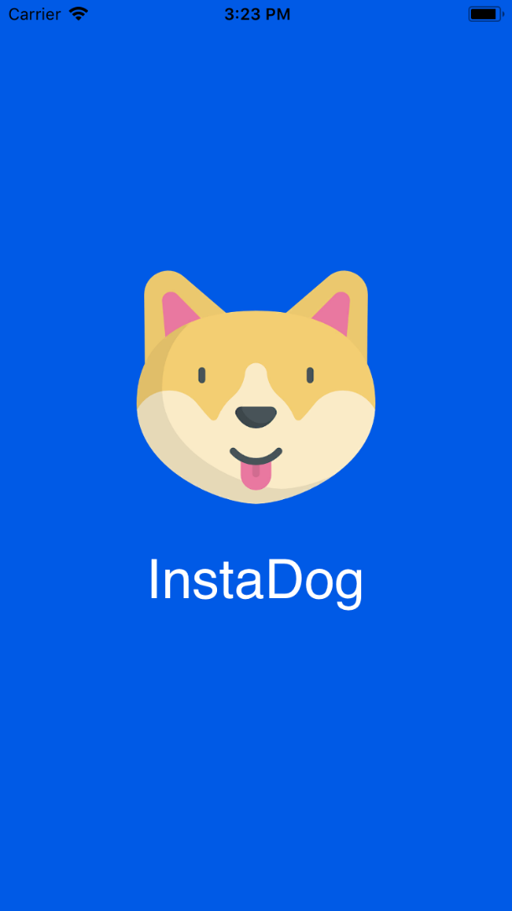
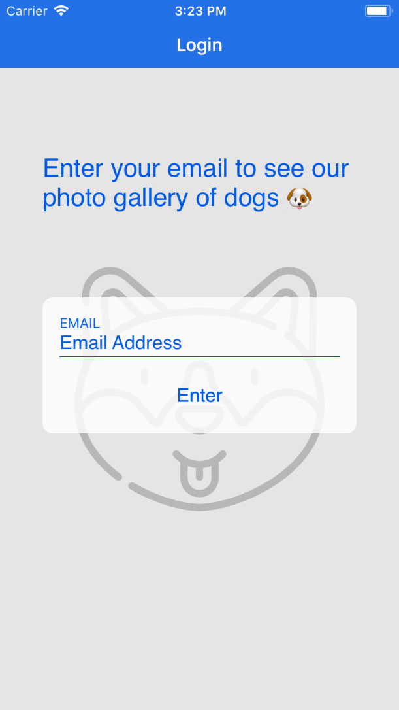
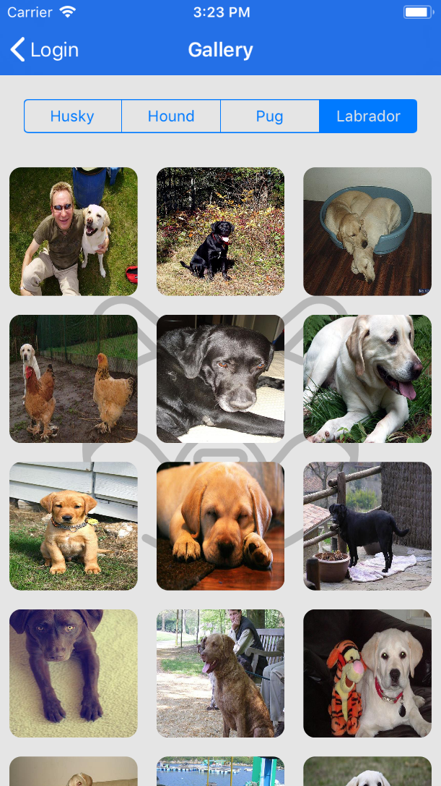
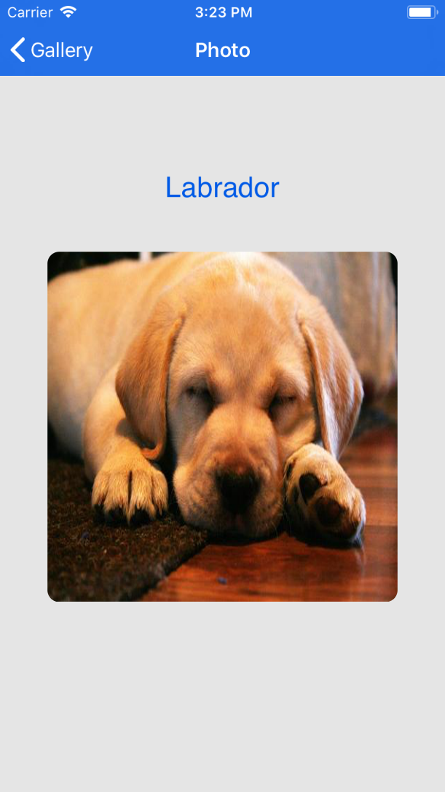

# InstaDog
### How to Execute
* Open the aplication folder and execute `pod install`, in your terminal.
* Open the `instadog.xcworkspace` file with you XCode and run the project.
### Libraries Used
* SkyFloatingLabelTextField - https://github.com/Skyscanner/SkyFloatingLabelTextField
* Alamofire - https://github.com/Alamofire/Alamofire
* ObjectMapper - https://github.com/Hearst-DD/ObjectMapper
* KeychainAccess - https://github.com/kishikawakatsumi/KeychainAccess
* Kingfisher - https://github.com/onevcat/Kingfisher
### Screenshots

 

